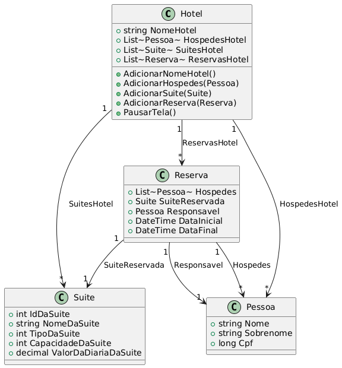

# Projeto Hospedagem Hotel

Sistema de gerenciamento de hospedagem para hotéis, desenvolvido em C# (.NET 9.0). Permite cadastrar hóspedes, suítes, reservas e consultar informações de hospedagem.

## Como Executar

### Pelo Visual Studio Code ou Terminal

1. Certifique-se de ter o [.NET 9.0 SDK](https://dotnet.microsoft.com/download/dotnet/9.0) instalado.
2. No terminal, execute:
   ```sh
   dotnet run
   ```

### Executável Standalone

Após compilar o projeto, o executável estará disponível em:

```
ProjetoHospedagemHotel\bin\Release\net9.0\win-x64\ProjetoHospedagemHotel.exe
```

Basta dar dois cliques ou executar pelo terminal:
```sh
ProjetoHospedagemHotel.exe
```

## 📊 Diagrama de Classes




Ao iniciar o programa, você verá o seguinte menu:

1. **Cadastrar novo hóspede**
   - Insira o nome, sobrenome e CPF do hóspede.
   - O sistema valida o CPF (apenas números, 11 dígitos).
   - O hóspede será salvo e poderá ser usado em reservas.

2. **Cadastrar nova suíte**
   - Informe o ID único, nome, tipo (Básica, Intermediária ou Completa), capacidade máxima e valor da diária.
   - O sistema valida cada campo e salva a suíte para futuras reservas.

3. **Quantidade de hóspedes cadastrados**
   - Exibe o número total de hóspedes cadastrados no hotel.

4. **Buscar Hóspede pelo CPF**
   - Digite o CPF para buscar e exibir informações do hóspede cadastrado.

5. **Adicionar reserva**
   - Informe os CPFs dos hóspedes da reserva (um por vez, ENTER para finalizar).
   - Escolha o responsável pela reserva (deve ser um dos CPFs informados).
   - Escolha o tipo de suíte.
   - Informe as datas de entrada e saída (formato dd/MM/yyyy).
   - O sistema valida todos os dados e adiciona a reserva.

6. **Histórico de reservas pelo CPF**
   - Digite o CPF do responsável para visualizar todas as reservas feitas por ele.

7. **Encerrar**
   - Salva todos os dados em arquivos JSON na pasta `Data` e encerra o programa.

## Persistência de Dados

- Os dados são salvos automaticamente em arquivos JSON na pasta `Data` ao sair do programa.
- O sistema utiliza [`Newtonsoft.Json`](https://www.nuget.org/packages/Newtonsoft.Json/) para serialização.

## Estrutura de Pastas

```
├── images/
│   └── diagrama-classes.png
├── Program.cs
├── Models/
│   ├── Hotel.cs
│   ├── Pessoa.cs
│   ├── Reserva.cs
│   └── Suite.cs
├── Data/
│   ├── Hotel
│   ├── Hospedes
│   ├── Suites
│   └── Reservas
├── ProjetoHospedagemHotel.csproj
├── bin/
│   └── Release/
│       └── net9.0/
│           └── win-x64/
│               └── ProjetoHospedagemHotel.exe
└── obj/
```

## Requisitos

- Windows 10 ou superior
- .NET 9.0 Runtime

## Licença

Projeto para fins
